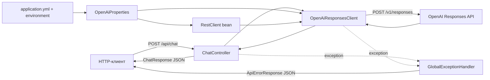

# Архитектура openai-chat

Документ описывает только реализованную архитектуру. Планируемые, но не реализованные компоненты не показаны как существующие.

## Общая схема

Приложение — stateless HTTP backend в одном Spring Boot процессе.



Нет базы данных, persistent storage, message broker, cache, отдельного frontend или внутренней микросервисной сети.

## Основные компоненты

### `ChatApplication`

`src/main/java/com/example/chat/ChatApplication.java`

Стандартная точка входа с `@SpringBootApplication`. Запускает embedded servlet container и Spring application context.

### API layer

`src/main/java/com/example/chat/api/`

- `ChatController` публикует `POST /api/chat`.
- `ChatRequest` — входной record с `@NotBlank` на поле `message`.
- `ChatResponse` — выходной record с полем `response`.
- `ApiErrorResponse` — единый контракт ошибки.
- `GlobalExceptionHandler` — `@RestControllerAdvice`, преобразующий validation, parsing, configuration, upstream и unexpected exceptions в HTTP-ответы.

Контроллер намеренно тонкий: валидирует тело средствами Spring MVC, передаёт строку в `OpenAiResponsesClient` и оборачивает результат в DTO. Отдельного service layer сейчас нет, потому что бизнес-логика кроме одного внешнего вызова отсутствует.

### Configuration layer

`src/main/java/com/example/chat/config/`

- `OpenAiProperties` связывает свойства с префиксом `openai`.
- `OpenAiConfiguration` регистрирует `OpenAiProperties` и создаёт singleton `RestClient` с `openai.base-url`.

`src/main/resources/application.yml` содержит несекретные defaults:

```yaml
openai:
  base-url: https://api.openai.com
  api-key: ${OPENAI_API_KEY:}
  model: gpt-4.1-mini
```

API-ключ не хранится в репозитории. Пустой default позволяет приложению запуститься без секрета; попытка обращения к OpenAI в таком состоянии завершается контролируемым `503` до сетевого вызова.

### OpenAI integration layer

`src/main/java/com/example/chat/openai/`

- `OpenAiResponsesClient` формирует запрос, выполняет его и извлекает текст.
- `OpenAiConfigurationException` означает отсутствие обязательной runtime-конфигурации.
- `OpenAiApiException` хранит ошибочный HTTP-статус upstream.
- `OpenAiServiceException` представляет transport, decoding и invalid-response ошибки.

Клиент отправляет:

```http
POST /v1/responses
Authorization: Bearer <OPENAI_API_KEY>
Content-Type: application/json
```

```json
{
  "model": "gpt-4.1-mini",
  "input": "текст пользователя"
}
```

Для ответа используется фактическая структура Responses API:

```text
output[] -> content[] -> элементы type=output_text -> text
```

Все непустые `output_text` объединяются символом перевода строки. Если `output`, content или текст отсутствуют, клиент выбрасывает контролируемое исключение вместо возврата пустого успешного ответа.

## Поток запроса

1. HTTP-клиент отправляет JSON в `POST /api/chat`.
2. Spring/Jackson десериализует тело в `ChatRequest`.
3. Bean Validation отклоняет blank `message`.
4. `ChatController` вызывает `OpenAiResponsesClient.createResponse(message)`.
5. Клиент проверяет наличие API-ключа.
6. `RestClient` отправляет модель и input в OpenAI Responses API.
7. Клиент извлекает `output_text` и возвращает строку контроллеру.
8. Контроллер сериализует `ChatResponse` в JSON.
9. Любое поддерживаемое исключение перехватывает `GlobalExceptionHandler` и возвращает `ApiErrorResponse`.

## Публичный API

### `POST /api/chat`

Request media type: `application/json`.

Request body:

```json
{
  "message": "Hello"
}
```

Success: `200 OK`.

```json
{
  "response": "Hello back"
}
```

Error body:

```json
{
  "timestamp": "2026-09-02T00:00:00Z",
  "status": 400,
  "error": "Bad Request",
  "message": "message must not be blank",
  "path": "/api/chat"
}
```

Текущие status mappings:

| Условие | HTTP status |
|---|---:|
| Blank message или malformed JSON | 400 |
| Ошибка HTTP/transport/response от OpenAI | 502 |
| Не задан `OPENAI_API_KEY` | 503 |
| Непредвиденное исключение | 500 |

API versioning, authentication и authorization сейчас отсутствуют.

## Тестовая архитектура

- `ChatControllerTest` использует `@WebMvcTest`, MockMvc и mock `OpenAiResponsesClient`. Эти тесты фиксируют внешний HTTP-контракт и error mapping без реальной сети.
- `OpenAiResponsesClientTest` связывает `MockRestServiceServer` с `RestClient.Builder`. Тесты фиксируют исходящий URL, метод, Authorization header, request JSON и разбор response JSON.
- Unit tests не требуют реального `OPENAI_API_KEY` и не обращаются к OpenAI.

Такое разделение проверяет обе HTTP-границы независимо и сохраняет тесты быстрыми и детерминированными.

## Deployment

Текущий deployment-модель — один JVM-процесс:

```bash
./gradlew bootJar
OPENAI_API_KEY="..." java -jar build/libs/openai-chat-0.0.1-SNAPSHOT.jar
```

Либо локальный запуск:

```bash
OPENAI_API_KEY="..." ./gradlew bootRun
```

Embedded web server слушает стандартный Spring Boot port `8080`, если он не переопределён runtime-конфигурацией.

В репозитории отсутствуют:

- Dockerfile и container image definition;
- Docker Compose;
- Nginx/reverse proxy configuration;
- VPS provisioning или service manager unit;
- Kubernetes manifests;
- CI/CD workflows;
- cloud-specific deployment configuration.

Поэтому Docker, Nginx и VPS не являются частью текущей архитектуры. При их добавлении необходимо задокументировать TLS termination, secret injection, port mapping, health checks, limits и process lifecycle.

## Безопасность и trust boundaries

- Входной HTTP JSON является недоверенным и валидируется на границе приложения.
- OpenAI — внешний upstream; его HTTP-статус и JSON не считаются гарантированно корректными.
- Секрет существует только в runtime environment и используется в Authorization header.
- `.env` исключён из Git. Приложение не реализует dotenv loader.
- Upstream body и stack trace не возвращаются API-клиенту.
- Пользовательский текст передаётся стороннему OpenAI API; политика хранения/приватности пользовательских данных в проекте пока не определена.
- Публичный endpoint не защищён authentication или rate limiting; это ограничение текущей реализации, а не предполагаемая защищённость.

## Принятые решения

### Spring `RestClient` вместо OpenAI SDK

Причина: текущий контракт использует один endpoint и простую структуру запроса. Встроенный клиент уменьшает число зависимостей и оставляет wire contract явным. Если функциональность Responses API существенно расширится, решение следует пересмотреть на основании реального объёма mapping-кода.

### Records для DTO и properties

Причина: объекты являются небольшими immutable data carriers без жизненного цикла и поведения.

### Централизованная обработка ошибок

Причина: API всегда получает предсказуемый формат, контроллер не содержит повторяющегося exception mapping, внутренние детали не утекают наружу.

### Запуск без API-ключа разрешён

Причина: context и unit tests могут стартовать без production-секрета. Ошибка возникает только при попытке вызвать OpenAI и явно возвращается как `503`.

### Stateless request model

Причина: исходное требование включает только одно сообщение и один ответ. История диалога, persistence и session identity не добавлялись без требования. Для conversation memory потребуется отдельное архитектурное решение о session identifier, storage, retention, concurrency и privacy.

### Отсутствие отдельного service interface

Причина: сейчас контроллер делегирует единственную операцию одному клиенту. Дополнительный интерфейс не создаёт полезной границы. Его следует вводить только при появлении независимой бизнес-логики или нескольких реализаций.
